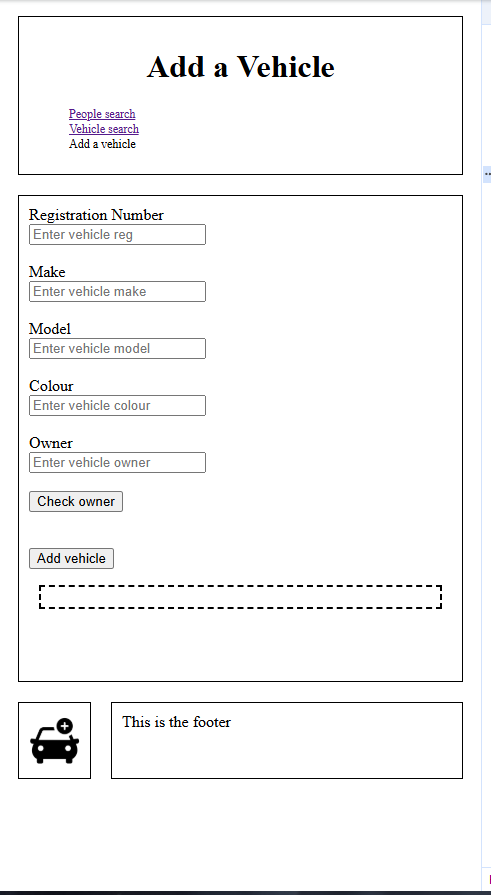
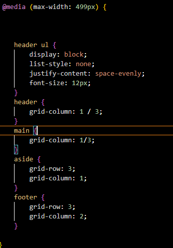
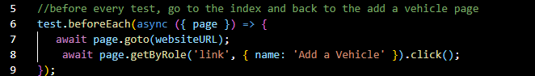
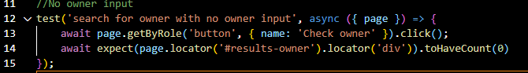
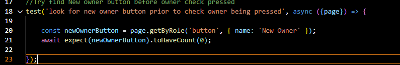
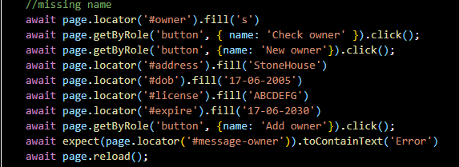
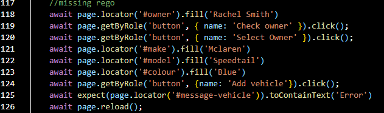
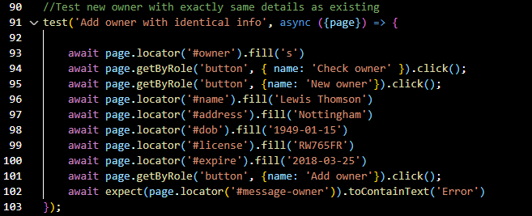
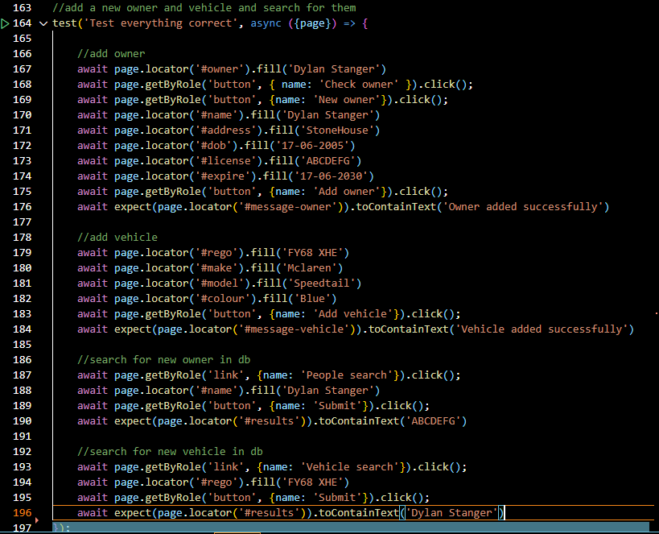

# Additional  Work
- This is the markdown file for the additional work for the HTML, CSS and JavaScript for this project 
## HTML

- Here is the screenshot of the 100 accessibility score
- To acheive 100, i ensured that I used semantic elements tags wherever possible
- Such as using the main for the main content (23 and 36), aside for the sidebar(lines 37 and 39), footer for the footer (line 40), header for the header (lines 13 and 22), and a nav for the navigation links (lines 15 and 21)
- All lines referenced above apply to index.html - similar practices were applied to the other two pages
- I also ensured to add the alt attribte to all of the pictures - to allow for audio description in the case of a blind user
- One example is on line 38 on index.html
## CSS

- This is the web page when the device size is under 500px
- I used the developer inspect tools to resize the screen and test

- Here is a screenshot of the media query that i used to provide the responsive design 
- This is line 74-99 from styles.css
- Initially for desktop, I style the page as a grid with 3 rows with 2 columns on each row spaced 20% to 80%
- The header takes up both columns on the first row and the footer takes up both on the final row
- The header contains a nav bar that was styled as flex to make the links side by side
- The aside and main take up the remaining row, split 20% aside, 80% main
- To acheive the responsive design, I used the media query to check whether the device was less than 500px 
- I then changed the nav bar in the header to have a block display to stack the links above one another 
- I then altered the positioning of all of the aforementioned 4 elements keeping the same grid display
- I kept the header in the first row
- I changed the main to take up the entire width of the second row
- I then brought the aside down to the third row with the footer, and styled the aside to the left of the footer taking up 20% of the space with the footer taking up the remaining 80%
## JavaScript
- For the JavaScript testing - I used the test file provided, and then created my own test file that covered many of the main exceptions from the 3rd Add a Vehicle page
- Initially my code passed all the tests from the provided file
- My code also passed all of the tests i created 
#### NOTE
- **When running my test file, 1 record is created in the database for a person and vehicle, so if other tests are dependent on the databse being in its initial state, they should be ran before my own tests**
- All of my tests are located in the **testForCw.test.js** file
### Before All 

- Here i added this snippet so that before every test that would run, it would return to the index page and then click the link to travel back the add a vehicle page, effectively refreshing the page between tests 
### No Owner Input

- Here i tested trying to press the check owner button with the owner field empty
- After attempting to press the button I made sure that the results box with the id #results-owner contained no results 
### New Owner Test

- Here I wrote a test that tries to find a button labeled new owner prior to check owner being pressed
- As the specification stated, this button must only appear after check owner is pressed
### Missing Fields Test -  New Owner

- Then i wrote a test that checks the functionality when the new owner form is missing data 
- I started by entering s into the intial owner input box and checked for owner to bring up the new owner button
- I then pressed the new owner button and entered values into every box bar one
- I then tried to click add owner and i analysed the message in the box with the ID #message-owner
- I was checking to see if the message contained 'Error' since every field is mandatory 
- Above is the code snippet from one of the tests, similar blocks were created for each missing attribute on the form
- The whole test ran from line 25 through to line 88
### Missing Fields Test - Add Vehicle 

- I then ran a similar test to before but with the add vehicle form
- I tested to make sure an error message was provided, in the message box with ID #vehicle-message, when there was a missing field or the owner was not selected properly 
- Again I entered details into every field bar one and tried to press the add vehicle button 
- Then checked for the error message 
- Again above is a code snippet from the test - the entire test ran from line 105 to 161
### Same Details as Existing Owner

- I also tested the case for when the user tried to add a new owner with the exact same details as an existing user
- For this I nagivated to the add owner form, same as before 
- However this time, I filled all of the inputs with the details of a person already in the database
- I then tried to add owner and checked for the error message in the box with the ID #message-owner
### Correct Usage 

- For my final test, i tested that the add a vehicle page worked as intended when the user provided all valid details when necessary 
- I started by creating a new owner, with every field filled with valid information
- I added the owner and checked for the success message 
- By creating the owner, the owner is selected by default
- I then filled in all of the add vehicle form with correct valid inputs and added the vehicle again checking  for the correct success message
- This should have added both entries into the database 
- I then navigated to the People search page, and tried to search for the owner the test just created
- I then navigated to the vehicle search page and tried to search for the new vehicle the test created
- **This test passes, however it does also create new entries in the database, so if these tests are going to be run during marking, and other tests are dependant on the database being intact, then they should be run prior to running my tests